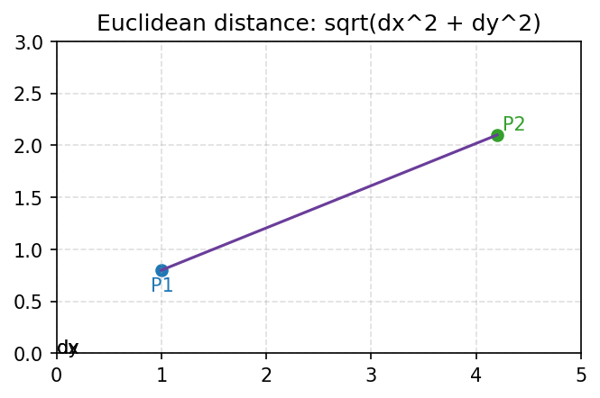
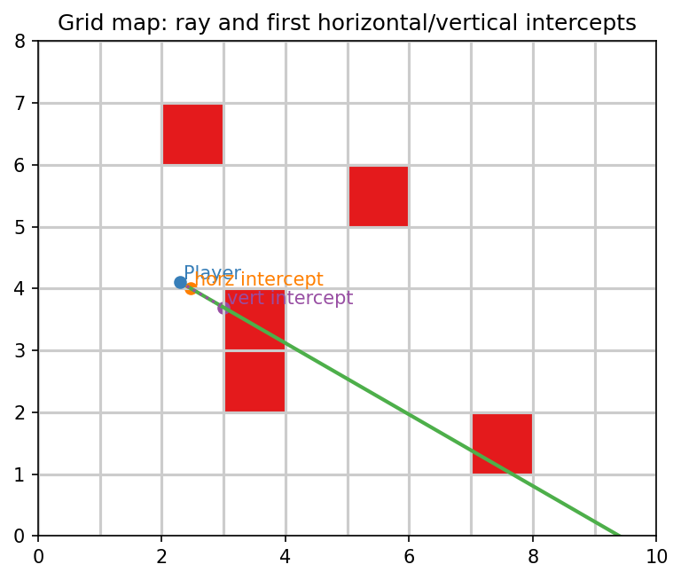
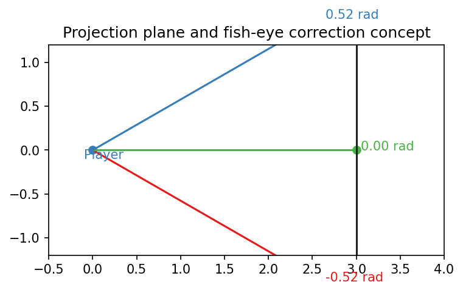

# Raycasting — Math Formulas with Diagrams

This single README lists each core mathematical formula used in the raycasting module.

---

**How to read this file**
- Each section shows the formula, where it is used (file + function), a short explanation, and an embedded diagram illustrating the concept.

---

## 1) Normalize angle to [0, 2π)

Formula
```
two_pi = 2.0 * PI
angle = fmod(angle, two_pi)
if (angle < 0) angle += two_pi
```

Why used / explanation:
- Reduces any real-valued angle into the canonical range [0, 2π). This is important so later directional checks (is_up, is_down, is_left, is_right) and trigonometric operations behave consistently.
- `fmod` computes the floating-point remainder; it preserves the sign of the dividend so negative results are adjusted by adding `2π`.

Diagram:


---

## 2) Euclidean distance between two points

Formula
```
dx = x2 - x1
dy = y2 - y1
distance = sqrt(dx * dx + dy * dy)
```

Where used:
- `srcs/raycasting/utils.c` -> `distance_btw_pts`
- Called from `srcs/raycasting/cast_ray.c` to compute distances from the player to horizontal and vertical wall hit candidates.

Why used / explanation:
- Classic distance formula for 2D Cartesian coordinates; used to decide which intersection (horizontal vs vertical) is closer to the player, and to compute the ray distance for projection.

Notes:
- Uses `sqrt` from `<math.h>`; inputs are tile-space coordinates (floating point), so results are in map units (tiles).

Diagram:



---

## 3) Map cell lookup (tile index from world coordinates)

Formula
```
min_x = (int)floor(x)
min_y = (int)floor(y)
```

Where used:
- `srcs/raycasting/intersections.c` -> `has_wall`

Why used / explanation:
- Converts floating-point world coordinates to integer tile indices. `floor` ensures coordinates inside a tile map to that tile index.
- Used to check whether a given world point hits a wall (`map[min_y][min_x] == '1'`).

Notes:
- The code also checks bounds (min_x/min_y vs map width/height) and treats out-of-bounds as wall (returns 1).
- A small epsilon is added elsewhere (e.g., `-1e-6`) to avoid ambiguous edge cases when checking vertical hits on tile boundaries.

Diagram (grid context):



---

## 4) Horizontal grid intersection computations

Formulas in `horizontall_intersection`:
```
y_intercept = floor(player.y / TILE_SIZE) * TILE_SIZE
y_intercept += ray.is_down ? TILE_SIZE : 0
tan_a = tan(ray.ray_angle)
x_intercept = player.x + (y_intercept - player.y) / tan_a  (unless tan_a ≈ 0)
ystep = TILE_SIZE * (ray.is_up ? -1 : 1)
xstep = TILE_SIZE / tan_a
```

Where used:
- `srcs/raycasting/intersections.c` -> `horizontal_intersection` and helper `is_horz_inter`

Why used / explanation:
- Raycasting with grid stepping: compute the first horizontal gridline intersection (y) and corresponding x, then step along gridlines (xstep, ystep) to find the next potential horizontal intersections.
- `tan(ray_angle)` relates vertical to horizontal step via the ray slope: Δx = Δy / tan(angle).
- `ystep` is ±TILE_SIZE depending on whether the ray points up/down.

Notes:
- After computing intercepts and steps, `is_horz_inter` iterates `next_horz_x += xstep; next_horz_y += ystep` until a wall is found or bounds exceeded.

Diagram (shows a ray and first horizontal intercept):


---

## 5) Vertical grid intersection computations

Formulas in `vertical_intersection`:
```
x_intercept = floor(player.x / TILE_SIZE) * TILE_SIZE
x_intercept += ray.is_right ? TILE_SIZE : 0
y_intercept = player.y + (x_intercept - player.x) * tan(ray.ray_angle)
xstep = TILE_SIZE * (ray.is_left ? -1 : 1)
ystep = TILE_SIZE * tan(ray.ray_angle)
```

Where used: `intersections.c` -> `vertical_intersection` and `is_vert_inter`

Why used / explanation:
- Mirror of horizontal logic, stepping along vertical gridlines: compute first vertical intersection and then step by `xstep` (±TILE_SIZE) and `ystep` (Δy = Δx * tan(angle)).
- `y_intercept` computed using slope `tan_a` multiplied by horizontal delta.

Notes:
- `is_vert_inter` adjusts the `check_x` by a tiny epsilon (`-1e-6`) when ray is left to ensure the correct adjacent tile is tested (prevent false positives on exact boundaries).
- `fabs(tan_a) < 1e-9` avoids dividing by zero for nearly-vertical rays by using INFINITY for `ystep`.

Diagram (shows a ray and first vertical intercept):


---

## 6) Ray direction / quadrant checks

Formulas / conditions:
```
is_down:  (ray_angle > 0 && ray_angle < PI)
is_up:   otherwise
is_right: (ray_angle < 0.5*PI || ray_angle > 1.5*PI)
is_left: otherwise
```

Where used: `cast_ray.c` -> `init_ray_vars`

Why used / explanation:
- Determine ray orientation (up/down, left/right) from the angle. Used to select correct initial intercept offset and step sign.
- These checks assume normalized angles in [0, 2π); comparisons rely on `PI`, `0.5*PI`, `1.5*PI` thresholds.

Diagram (unit circle / normalized angles):


---

## 7) Player angle and ray generation

Formulas in frame setup (`draw_frame.c`):
```
player_angle = atan2(player.dir_y, player.dir_x)
half_fov = FOV_ANGLE / 2
initial ray_angle = player_angle - half_fov
distance_proj_plane = (width / 2.0) / tan(half_fov)
curr_angle = normalize_angle(ray_angle + col * (FOV_ANGLE / width))
```

Why used / explanation:
- `atan2` recovers the player's facing angle from the direction vector.
- Rays are generated across the field of view (FOV_ANGLE) evenly; each screen column corresponds to a ray angle offset.
- `distance_proj_plane` is the distance from the player to the projection plane in a typical pinhole camera model: (screen_half_width) / tan(half_fov).

Notes:
- `curr_angle` must be normalized; the code uses `normalize_angle` per column.

Diagram (projection plane):



---

## 8) Fish-eye correction and projected wall height

Formulas
```
corrected_distance = ray.distance * cos(normalize_angle(curr_angle - player_angle))
wall_strip_height = (TILE_SIZE / corrected_distance) * distance_proj_plane
draw_start = -wall_strip_height/2 + height/2
draw_end = wall_strip_height/2 + height/2
```

Where used: `draw_frame.c` -> `draw_frame`

Why used / explanation:
- `cos` correction removes fish-eye distortion: rays that deviate from the player's viewing direction have a longer measured distance; multiplying by cos(angle difference) projects the distance onto the player's view axis.
- Wall height on screen is computed by similar triangles: real wall height (TILE_SIZE) divided by distance -> scale factor applied by `distance_proj_plane` to convert into pixel height.
- `draw_start`/`draw_end` center the wall strip vertically on the screen.

Notes:
- The code guards `corr_dist` against non-positive values by setting a very small positive fallback (1e-30).

Diagram (projection / rays at different angles):


---

## 9) Player movement and strafing

Formulas
```
- forward/backward move:
  - new_x = player.x ± player.dir_x * MOVE_STEP
  - new_y = player.y ± player.dir_y * MOVE_STEP
- strafing (using camera plane):
  - new_x = player.x ± player.plane_x * MOVE_STEP
  - new_y = player.y ± player.plane_y * MOVE_STEP
```

Where used: `player_pos.c` -> `mini_upd`, `mini_upd_II`

Why used / explanation:
- Move the player along the facing direction vector or perpendicular camera plane for strafing.
- MOVE_STEP is the movement step size per frame.

Notes:
- Movements are validated with `has_wall` before committing to avoid walking through walls.

Diagram (rotation and movement basis):


---

## 10) Rotation (2D rotation matrix)

Formulas:
- old_dirx = dir_x
- dir_x = dir_x * cos(angle) - dir_y * sin(angle)
- dir_y = old_dirx * sin(angle) + dir_y * cos(angle)
- len = sqrt(dir_x^2 + dir_y^2); normalize direction by dividing by `len` if non-zero.
- plane_x = dir_y * plane_len
- plane_y = -dir_x * plane_len

Where used: `player_pos.c` -> `rotate_player`

Why used / explanation:
- Applies the 2D rotation matrix to rotate the player's direction vector by `angle` (positive or negative). The camera plane is recomputed to stay perpendicular to the direction while preserving its original length (plane_len) so FOV and projection remain consistent.

Notes:
- The code recomputes and preserves `plane_len` (initial plane magnitude) to maintain the same projection scaling after rotation.

Diagram:


---

## 11) Minor numeric safeguards and small epsilons

Examples
- `fabs(tan_a) < 1e-9` used to avoid division by zero when `tan` is nearly zero.
- `-1e-6` applied in `is_vert_inter` to shift the check coordinate slightly when checking left-facing vertical hits.
- `INFINITY` used to disable stepping when direction makes intercept computation invalid.

Where used: `intersections.c` and helpers

Why used / explanation:
- Prevents float rounding issues and ambiguous boundary checks. Small epsilons ensure the algorithm tests the intended adjacent tile rather than the shared boundary.

---

## Quick cross-reference (file -> main math concepts)

- `utils.c`:
  - `normalize_angle` (modulo 2π), `distance_btw_pts` (Euclidean distance)
- `intersections.c`:
  - horizontal and vertical grid intersection math (floor, tan, intercepts, steps), has_wall uses floor to map world coords to tile indices
- `cast_ray.c`:
  - ray direction/quadrant tests (angle thresholds)
- `draw_frame.c`:
  - `atan2` to compute player angle; projection math (projection plane distance, fish-eye correction, wall height calculation)
- `player_pos.c`:
  - movement along direction and plane vectors; 2D rotation matrix and normalization

---
